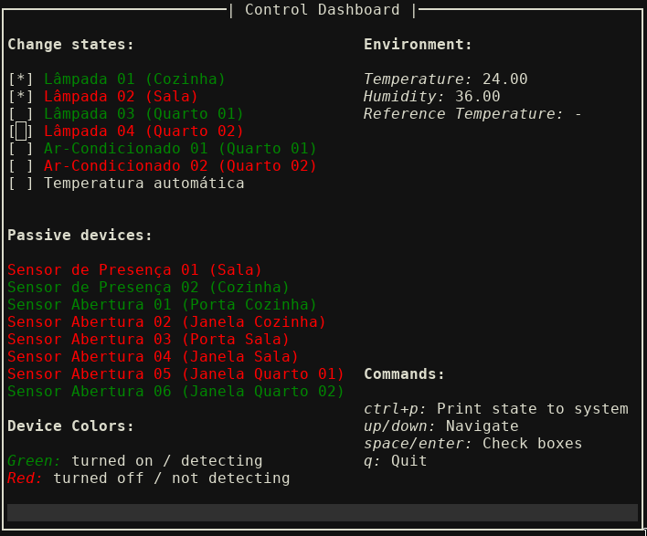

# Embedded Systems - Home Automation Servers

The objective of this application is to control an simulated environment for home automation. It is a college project from the discipline of Fundamentals of Embedded Systems. The complete description is here [Project Description](https://gitlab.com/fse_fga/projetos/projeto-2).

## Demonstration




## Building

The code was developed and tested in two Raspberries Pi.

### External dependencies

These are dependencies which are not cloned with this repository:

* [OMX Player](https://www.raspberrypi.org/documentation/usage/audio/) (For sounding the alarm)

* `requirements.txt` (install with `pip install -r requirements.txt --user`, better inside a virtual environment than `--user`)

1. Clone the repository:

``` bash
git clone --recursive https://github.com/icaropires/embedded-temperature-on-off
```

2. `cd` into project's dir and build it:

``` bash
cd embedded-systems-home-automation-servers/distributed
make
```

## Running

With the dependencies installed, run the central server:

```python3
python3 central/central.py
```

And the distributed server:

``` bash
distributed/bin/bin
```

Without the needed hardware for the distributed, you can also run [mock.py](scripts/mock.py).

## Some more details

* There are two servers, a distributed and a central and both communicate through TCP protocol (could be expanded to more distributed servers)
* Central server communicates with the sensors and actuators
* Central server runs a terminal based UI, which controls the distributed server
* The application is heavily based in devices being identified by a type and an id
* Types are represented by 8 bits in payloads and enums in code
* The states from a specific type are represented by 64 bits
* Each bit from state represents a device, so there is a limitation of 64 devices for each type
* Device with `id = 0` is represented by the least significative bit from state, the one with id 1 the second bit from right to left and so on
* Big endian is used for network communication
